# Movie Dialogues

## An Analysis of Gender Representation and Language Use in Film

### Contents

- Movie Dialogues.pptx
    - Powerpoint materials for presentation
- Capstone1.ipynb
    - Raw code
- Images
    - Graphical representations of findings and data
- Data
    - movie_titles_metadata.txt
        - contains information about each movie title
        - fields: 
            - movieID, 
            - movie title,
            - movie year, 
            - IMDB rating,
            - no. IMDB votes,
            - genres in the format ['genre1','genre2', ... ,'genreN']
    - movie_characters_metadata.txt
        - contains information about each movie character
        - fields:
            - characterID
            - character name
            - movieID
            - movie title
            - gender ("?" for unlabeled cases)
            - position in credits ("?" for unlabeled cases) 
    - movie_lines.txt
        - contains the actual text of each utterance
        - fields:
            - lineID
            - characterID (who uttered this phrase)
            - movieID
            - character name
            - text of the utterance
    - movie_conversations.txt
        - the structure of the conversations
        - fields
            - characterID of the first character involved in the conversation
            - characterID of the second character involved in the conversation
            - movieID of the movie in which the conversation occurred
            - list of the utterances that make the conversation, in chronological 
                - order: ['lineID1','lineID2', ... ,'lineIDN']
                - has to be matched with movie_lines.txt to reconstruct the actual content

    - raw_script_urls.txt
        - the urls from which the raw sources were retrieved

### Description
This project analyzes gender differences in film using Cornell University's Movie Dialogues dataset.  The dataset, after cleaning, included 283,250 lines from conversations in 570 film scripts, spoken by 9,035 speakers, 4,302 of which were labeled for gender.  The variables tested included gender representation in film and its relationship to release date, rating, and genre, as well as differences in language use between genders.

### Process
#### Imports:
- Pandas
- Matplotlib
- Numpy
- Scipy
- Seaborn
- Dataframe_Image
- Wordcloud
- Collections
- Spacy
- NLTK

Data from the Cornell dataset was read in using Pandas dataframes.  There were some formatting errors in the original datasets which caused some lines to be unreadable, so any lines that returned an error were dropped, and any rows with missing data were deleted.  The dataframes were merged into one dataframe containing all the information in the set, which is where most of my analysis was conducted.  The gender column needed to be converted to a consistent case.  The original dataset labeled 3,774 characters' genders based on their actors' names and prioritized them based on their position in the credits, with some manual labeling.  I was able to label an additional 528 characters for gender based on NLTK's names corpora.  For instance, if a character's name existed in the NLTK female names corpus, and not the male corpus (to account for ambiguous cases), it was marked as female.  I also created a function to which I could manually pass names and gender labels as needed for special cases.  I recorded the new markings along with old in a new column in case the original needed to be referred to.  I also looped through the genres column in order to create a set of all genre names, which I used to create a dictionary of separate dataframe selections including only films which match each genre.  Genres which were represented by fewer than 10 movies were not analyzed for the purpose of this study.  The percentage of female lines for each movie, and for each genre, were recorded in new columns.  Wherever a percentage of female lines was taken, this was measured only against lines spoken by characters marked as male, and characters not marked for gender were not included.  Although almost half the characters were not marked for gender, these were generally lesser characters because of the dataset's original prioritization of credits position, not part of the main cast, and with much fewer lines.  The majority of lines had speaker's gender marked.  When taking line counts, movies with fewer than 120 lines in the script (or the selection of the script presented here) were not included, as well as movies for which characters unmarked for gender outweighed those who were marked.  Most of the visualizations herein were made using the aforementioned processed data.  Text cleaning was also conducted using NLTK.  I created a column with text that had punctuation removed, was tagged for part of speech, lowercased, tokenized, and lemmatized, and another column with the same processes as well as stopwords removed.  Language use comparisons were conducted on these columns as appropriate.  Hypothesis tests were conducted with a two-tailed t-test.

### Findings
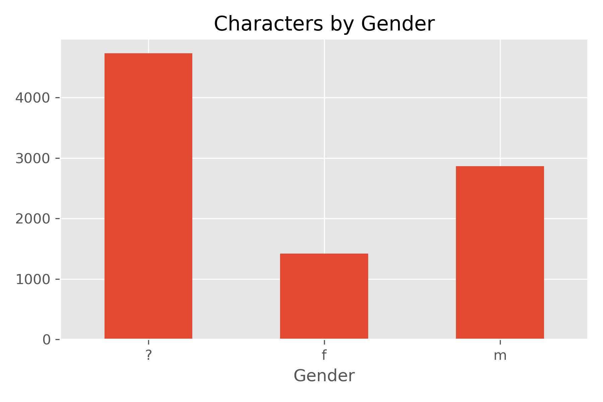
There were many more characters unmarked for gender than either male or female, even after my additional processing.
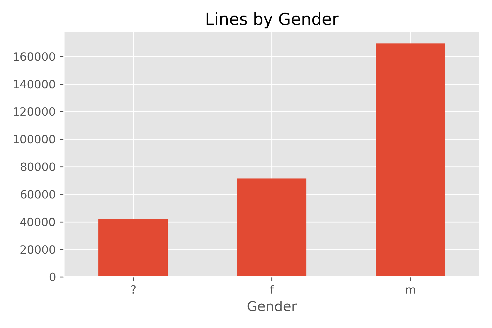
However, this graph illustrates the fact that most of these characters were lesser characters and not part of the main cast, due to the dataset's creators' prioritization of position in credits.  These characters' lines made up the minority of the total spoken lines.
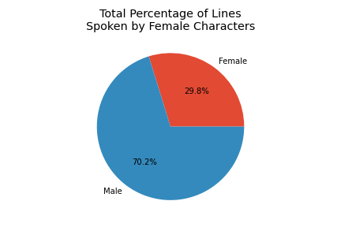
Only 30% of lines total were spoken by female characters.
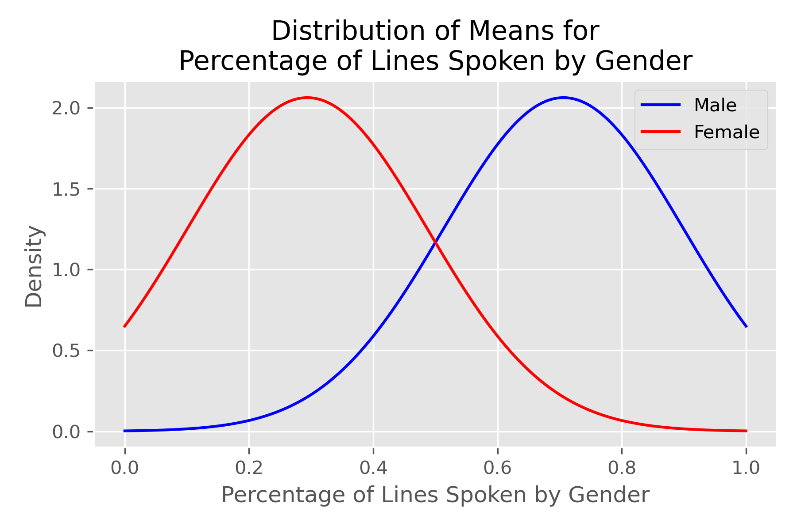
A hypothesis test was conducted using a two-tailed t-test.  The null hypothesis was that there would be no significant difference in the number of female and male spoken lines.  The alternate hypothesis was that women would have fewer spoken lines than men.  Given a p value of 9.5E-134, being less than the chosen alpha of 0.05, the data is statistically significant and the null hypothesis can be rejected.
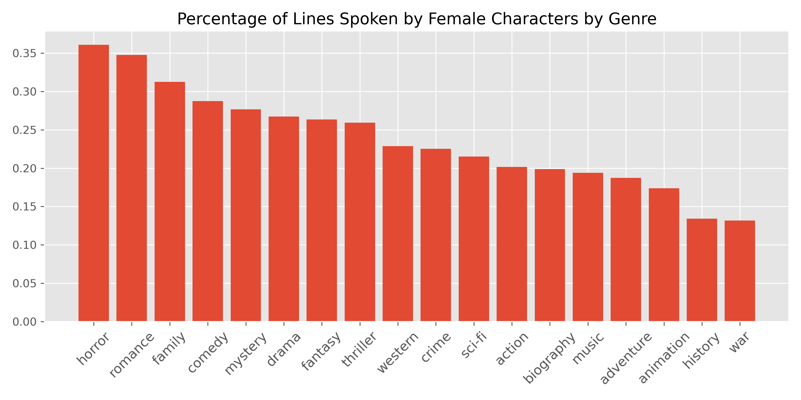
Horror, romance, and family are the genres with the highest percentage of female lines, while animation, history, and war have the fewest female lines.
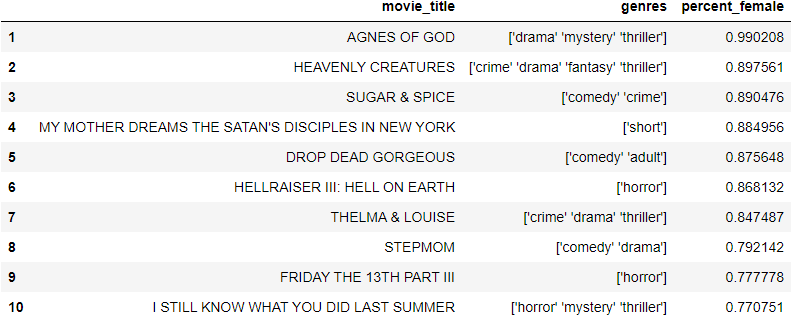
The movies with the highest percentage of female lines are from a variety of genres.
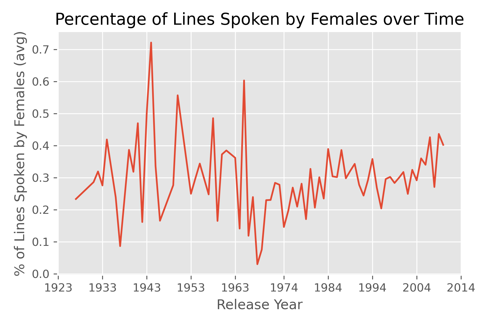
Before about 1965, the percentage of female lines in a given film based on its release date was quite varied, possibly due to a lower representation of older films in this dataset.  After this time, there appears to be a slow but steady increase in percentage of female lines over time.
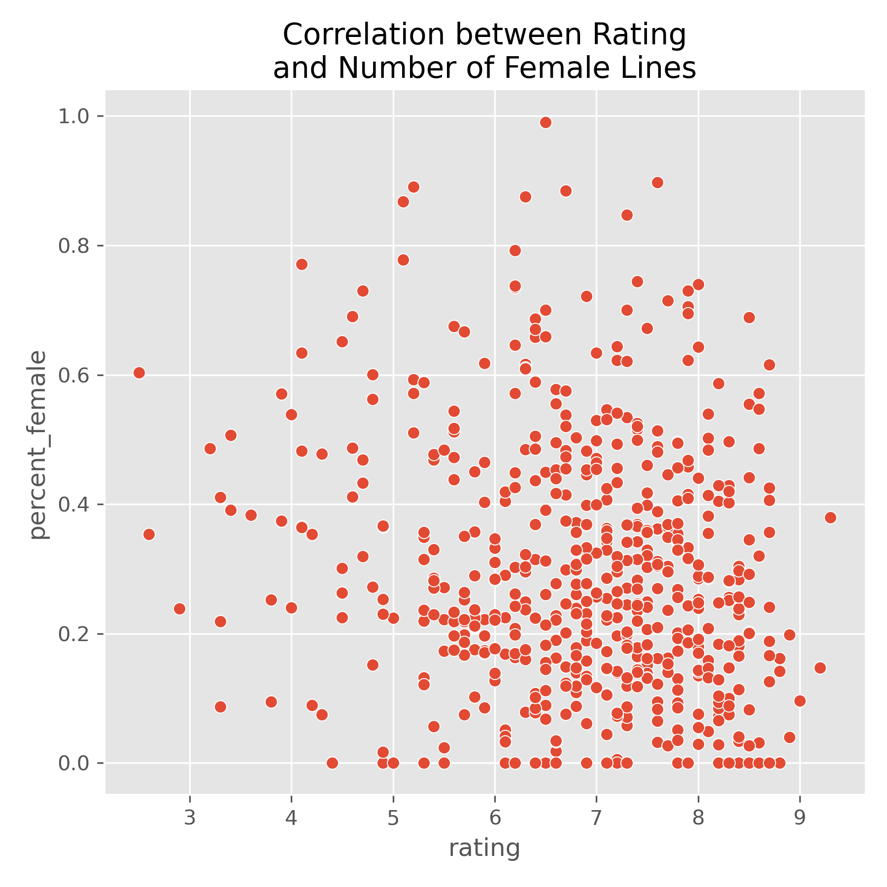
As a movie's rating increases, the percentage of female lines it is likely to have decreases.  The two are negatively correlated.
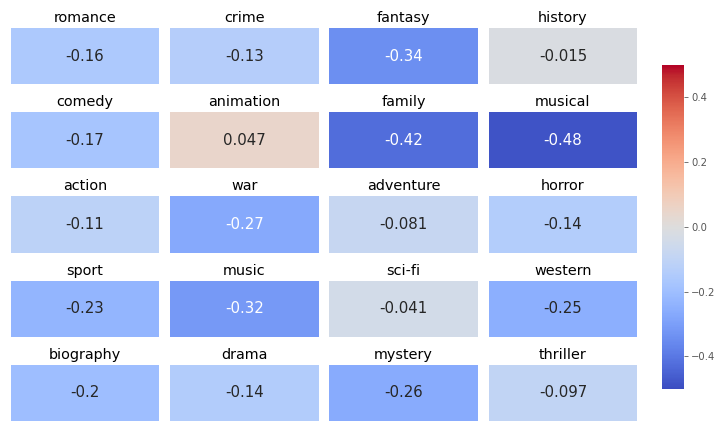
Most genres have a slight negative correlation between rating and number of female lines.  The only genre with a positive correlation between the two variables is animation, although just barely.  This is also one of the genres with the least female lines overall.

A hypothesis test was conducted using a two-tailed t-test, comparing movies with more male lines with movies with more female lines.  The null hypothesis was that a movie's rating does not correlate with the most prominent gender represented in its overall line count.  The alternate hypothesis was that rating is negatively correlated with the prominence of female-spoken lines.  Given a p-value of 0.0018, being less than the chosen alpha of 0.05, the data is statistically significant and the null hypothesis can be rejected.
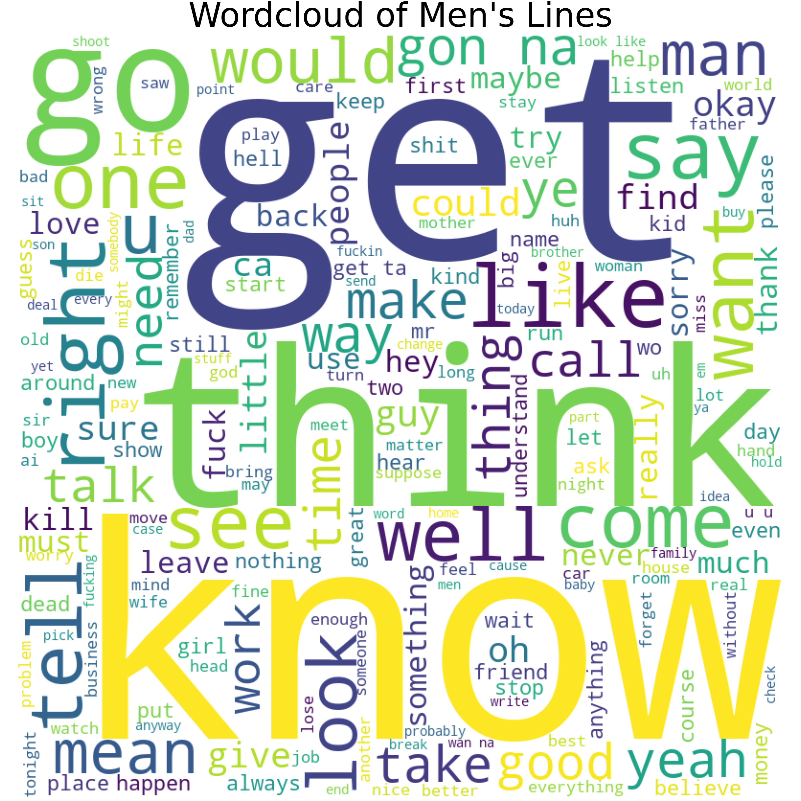
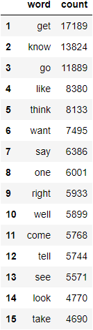
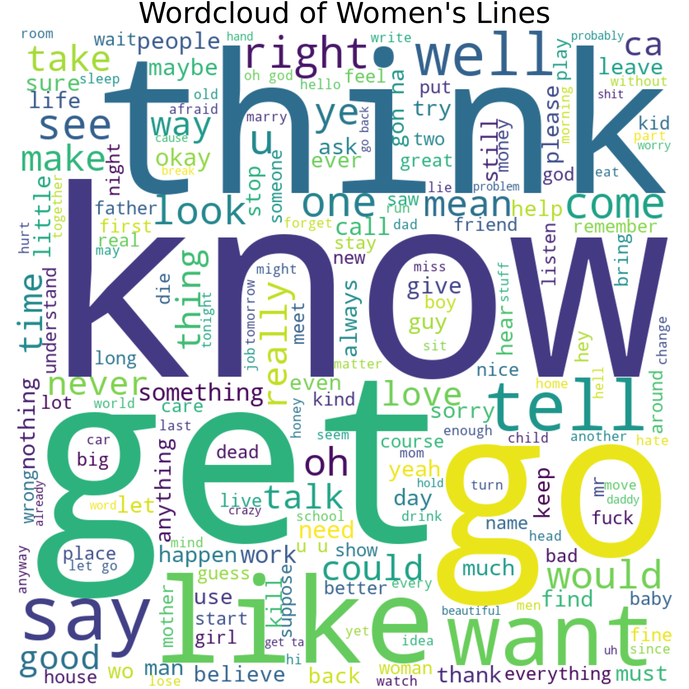
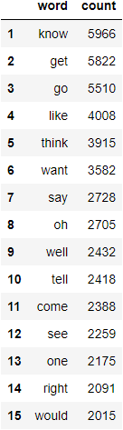
There is almost no difference between the top words spoken by female and male characters, except that there is a bit of a bigger difference between the top three words spoken by males and the rest of their most common words, whereas female words have a more consistent occurrence.  This may be due to a higher count of male words overall.
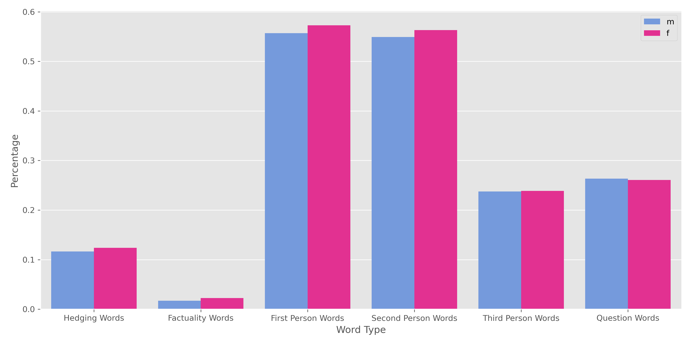
As a quick delve into the types of words that may be worth further examination in an analysis of gender differences, I created a few lists of words in a few categories.  There was very little difference between the two genders, and this exploration did not result in an interesting direction for my research to continue.  Some example words from each category:
- Hedging words
    - might, may, think, possibly, maybe, seem
- Factuality words
    - really, definitely, absolutely, positive
- First person
    - I, we, my
- Second person
    - you, your, yourself
- Third person
    - she, he, her, him, they, their, them
- Questions
    - how, who, when, what, where, why
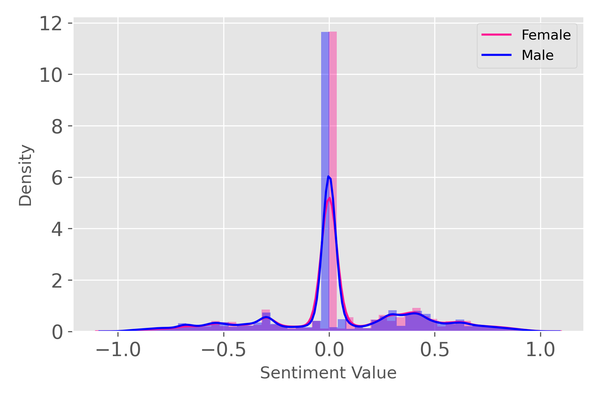
Sentiment scores were overwhelmingly neutral.  This may imply a need for better training of the model.  Male and female sentiments did not show any difference in sentiment dependent on gender.
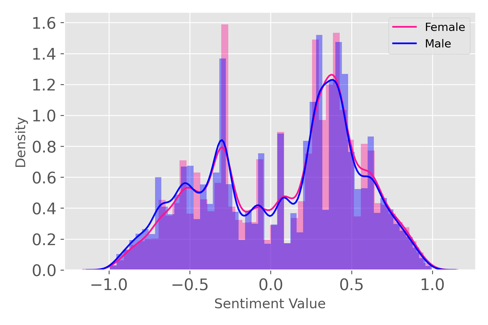
This is a plot with sentiment scores of exactly 0 removed, so as to zoom in on the positive and negative cases.  Still, even with more peaks and valleys, male and female sentiment track almost identically.

### Sources
https://www.kaggle.com/Cornell-University/movie-dialog-corpus
